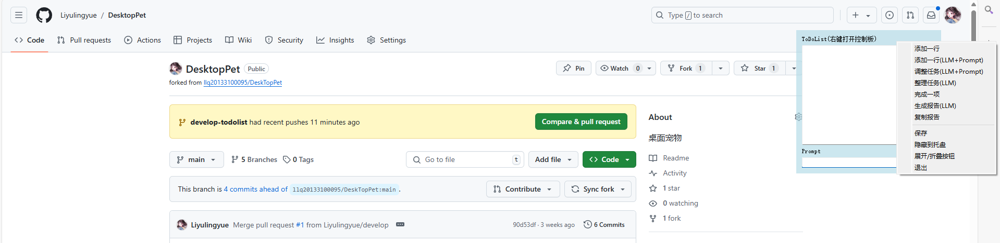
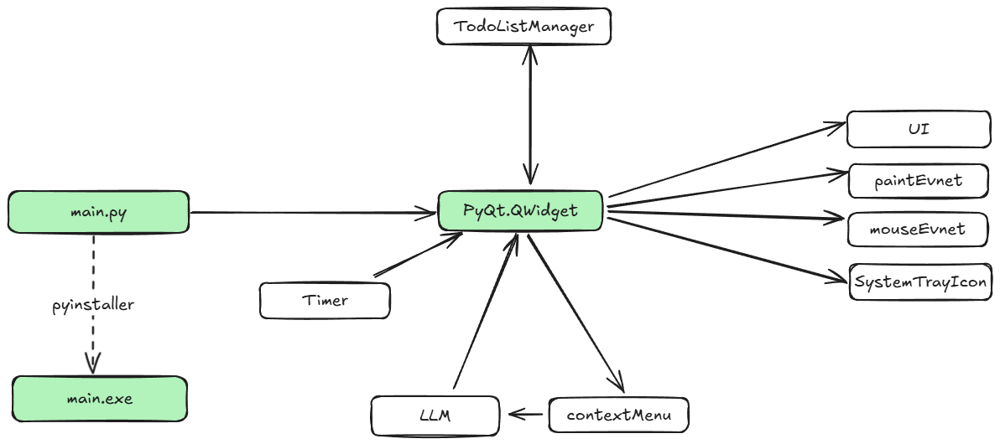

# 基于大模型功能扩展的桌面便签程序  

一个桌面便签程序，在桌面上有一个置顶的文本框，用户可以在其中输入代办事项，用户可以将便签框收纳到托盘区/显示便签框。相比于传统桌面便签，该程序内置了大模型模块，能够通过提示词工程对待办事项进行调整、生成日报。

<span style="color: red;">注1：大模型的指令遵循能力可能不稳定，会导致部分功能会运行失败。但`生成报告`等基础功能的运行成功率是比较高的。</span>

<span style="color: red;">注2：请务必配置好大模型再使用相关功能，否则程序可能无法正常工作。(对电脑无害，只是本程序会卡死)</span>

## 特性  
  
- **桌面悬浮便签**：支持便签框在桌面上方悬浮，方便随时查看和编辑。  
- **隐藏/显示功能**：支持一键隐藏和显示便签框。  
- **基于 Prompt 的 TODO 管理**：利用大模型实现智能化的 TODO 项添加和整理。  
- **日报生成**：支持一键生成每日代办事项的日报。  
- **大模型支持**： 
   - 本地部署：基于 Openvino 的 GLM3
   - API调用：文心一言
   - 远程部署：通过Gradio生成调用API

## 运行示例 
运行后，会生成一个悬浮在桌面上的便签框，右键边缘区域，可以执行对应操作。隐藏后，你也可以通过右击托盘区域的图标执行相关操作。


功能演示如下：


## 快速开始 

1. 下载或克隆本项目到本地。  
```commandline
git clone -b develop-todolist https://github.com/Liyulingyue/DesktopPet.git
```

2. 安装必要依赖

默认依赖文心一言API运行大模型功能，如果需要 GLM3 模型，请安装对应的其他依赖（下一个章节介绍）
```commandline
pip install -r requirements.txt
```

3. 配置大模型
   1. 文心一言

      在 `/Source/config.json` 文件中配置如下字段
        ```json
        LLM: ernie
        ErnieToken: <你的token，你可以从 "https://aistudio.baidu.com/account/accessToken" 获取此token>
        ```

   2. 基于Openvino量化后的 GLM3 模型
    - 根据 https://github.com/openvino-dev-samples/chatglm3.openvino 获取量化后的 GLM3 模型，并安装相关依赖
    - 将量化后的模型拷贝到项目文件夹 `/Source/Model/chatglm3-6b-ov` 文件夹下（文件夹下包含 `openvino_model.bin`, `openvino_model.xml` 等文件）
    - 在 `/Source/config.json` 文件中配置如下字段
        ```json
        LLM: glm3
        GLM3Directory: Source/Model/chatglm3-6b-ov
        ```
   3. 远程服务器部署
     - 以部署Qwen2为例，参考 `https://github.com/QwenLM/Qwen` 下载相关依赖后，在远程服务器运行gradio脚本（可以参考 `/Scripts/gradio_code_qwen.py`
     - 在 `/Source/config.json` 文件中配置如下字段
        ```json
        LLM: GRADIO
        GradioURL: http://116.62.10.217:8890/ # 116.62.10.217需要改成你自己的服务器IP，8890需要改成你自己的端口号
        ```

3. 运行 `main.py` 启动程序
```commandline
python main.py
```

4. 在弹出的便签栏记录你需要做的事情，便签会一直悬浮在桌面上方，方便随时查看。当你隐藏便签后，可以通过右键托盘区域的图标，再次显示便签。  

5. 如果你需要将程序分享给其他人使用，请参考如下步骤：
   1. 安装 Pyinstaller 
      
      `pip install pyinstaller`
   
   2. 打包程序 
       > 注意，如果你使用了openvino，需要使用 --collect-all 进行打包。如果你使用gradio，需要从.spec对打包格式进行配置，请参考 https://blog.csdn.net/m0_74259636/article/details/135487933 。

       `pyinstaller -F -w main.py` 
   
   3. 将Source和exe放在同级目录下发给其他人即可。

## 代码框架


## 鸣谢
本项目参考了以下开源项目：
- https://github.com/openvino-dev-samples/chatglm3.openvino
- https://github.com/llq20133100095/DeskTopPet

## 贡献与反馈
欢迎任何形式的贡献和反馈！如果您发现问题或有改进建议，请通过 GitHub Issues 提交。
