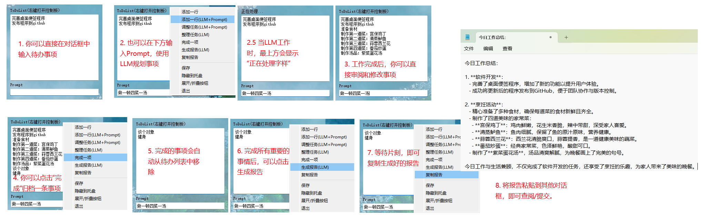

# 基于大模型功能扩展的桌面便签程序  

这是一个基于 PyQt5 的桌面便签小程序，不仅具备传统桌面便签的基本功能，还通过集成大模型实现了基于 Prompt 的 TODO 项管理和整理功能。  

其主要功能如下：
1. 在桌面上有一个透明的便签框，用户可以在其中输入代办事项
2. 能够通过大模型帮助用户生成待办事项（例如用户希望运行一个桌面便签程序，但不知道如何运行，需要补充必要的知识，大模型能够自动识别相关信息路径，生成多个待办事项：了解Git、配置本地环境、配置Python环境和运行脚本）
3. 能够通过大模型帮助用户整理代办事项（例如用户当前有数十个待办事项，部分事项的优先级突然降低了，大模型可以根据Prompt帮助用户一键对代办事项重新排序）

## 特性  
  
- **桌面悬浮便签**：支持便签框在桌面上方悬浮，方便随时查看和编辑。  
- **隐藏/显示功能**：支持一键隐藏和显示便签框。  
- **基于 Prompt 的 TODO 管理**：利用大模型实现智能化的 TODO 项添加和整理。  
- **大模型支持**：通过配置文件指定大模型，能够在本地CPU上使用 Openvino 提供的量化 GLM3 模型，也可以访问远程 API 服务。 

## 运行示意图
### 运行环境


### 运行效果



## 快速开始 
  
1. 下载或克隆本项目到本地。  
```commandline
git clone -b develop-todolist https://github.com/Liyulingyue/DesktopPet.git
```
2. 安装必要依赖
```commandline
pip install -r requirements.txt
```

3. 配置大模型（支持本地 CPU 和远程 API 服务，任选其一）
   1. 本地 CPU （不建议）
    - 根据 https://github.com/openvino-dev-samples/chatglm3.openvino 获取量化后的 GLM3 模型
    - 将量化后的模型拷贝到项目文件夹 `/Source/Model/chatglm3-6b-ov` 文件夹下（文件夹下包含 `openvino_model.bin`, `openvino_model.xml` 等文件）
    - 在 `/Source/config.json` 文件中配置如下字段
     ```json
     LLM: glm3
     GLM3Directory: Source/Model/chatglm3-6b-ov
     ```
   2. 远程 API 服务（推荐）
     - 在 `/Source/config.json` 文件中配置如下字段
     ```json
     LLM: ernie
     ErnieToken: <你的token，你可以从 "https://aistudio.baidu.com/account/accessToken" 获取此token>
     ```
3. 运行 `main.py` 即可启动程序
```commandline
python main.py
```

4. 在弹出的便签栏记录你需要做的事情，便签会一直悬浮在桌面上方，方便随时查看。当你隐藏便签后，可以通过右键托盘区域的图标，再次显示便签。  

5. 如果你需要将程序分享给其他人使用，请参考如下步骤：
   1. 安装 Pyinstaller `pip install pyinstaller`
   2. 打包程序 `pyinstaller -F -w --collect-all openvino main.py` （注意：如果打包失败，可能需要从spec文件开始修改打包配置）
   3. 将Source和exe放在同级目录下发给其他人即可。

## 技术细节
### 界面框架
本项目使用 PyQt5 作为图形界面框架，PyQt5 是一个用于创建桌面应用程序的跨平台工具包。

### 大模型集成
通过 Openvino 框架，本项目集成了量化后的 GLM3 模型，以支持基于 Prompt 的 TODO 项管理功能。

Openvino 提供了高效的模型加载和推理能力，确保程序在低资源消耗下运行。

## 功能细节
### TODO 项管理
添加 TODO 项：
用户输入 Prompt 后，点击“添加”按钮，程序会将该 Prompt 添加到 TODO 列表中，并显示在界面上。

整理 TODO 项：
用户可以选择对 TODO 项进行整理，例如根据优先级、完成状态等进行排序或分类。
使用 GLM3 模型对输入的整理 Prompt 进行解析，并执行相应的整理操作。

### 隐藏/显示功能
隐藏便签：
点击“隐藏”按钮，便签框将隐藏到屏幕边缘或最小化到系统托盘。

显示便签：
通过点击特定的快捷键或系统托盘图标，可以重新显示便签框。

## 鸣谢
本项目参考了以下开源项目：
- https://github.com/openvino-dev-samples/chatglm3.openvino
- https://github.com/llq20133100095/DeskTopPet

## 贡献与反馈
欢迎任何形式的贡献和反馈！如果您发现问题或有改进建议，请通过 GitHub Issues 提交。
