# DesktopPet
> Liyulingyue: \
> 由于某个朋友突然对桌面宠物有点兴趣，于是顺手fork了源项目，并不断修改添加了一些自己的想法。 \
> 由于本人非常懒散，所以文档会写的非常不全面。

## 快速使用
打开`Source/config.yaml`，根据修改对应的元素即可。

如果你需要使用文心一眼，请前往星河社区获取你的accesstoken，具体方法百度就行~

## 打包方式
1. `pip install pyinstaller`
2. `pyinstaller -F -w main.py`
3. 将Source文件夹复制到dist目录中

# 定制你的宠物桌面
> 来源于原项目，可能当前不是特别适用

最近想要做一个自己独一无二的桌面宠物，可以直接使用python来自己订制。属于一个小项目，这个教程主要包含几个步骤：

1. 准备需要的动图素材

2. 规划自己需要的功能

3. 使用python的PyQt5订制功能

在这个教程中，我主要实现了桌面宠物的几个功能：

1. 每隔一段时间切换动图素材+文字
2. 点击宠物时有额外动作
3. “故事大会”功能：跟宠物聊天，进行文本生成
4. “休息一下”功能：隔一个小时提醒你休息功能

话不多说，让我们开始把。

# 1. 准备需要的动图素材
这些素材你可以直接从网上下载找到，比如可以去动图素材网站：
[https://www.soogif.com/](https://www.soogif.com/)

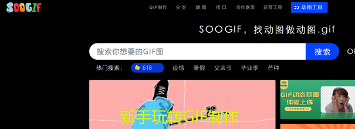  

搜索我要的动图“皮卡丘”，下载之后就需要对素材的背景去掉，设置成透明状态。

## 1.1 去除动图背景
这里可以利用PS（也可以使用网页版PS）工具，对动图去除背景。首先把动图导入到PS中，得到如下所示：

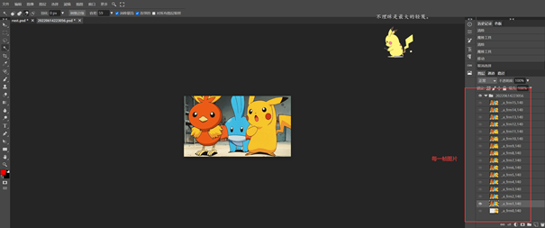  


其中最右边时每一帧的图片，选中其中一个图片，然后点击显示眼睛按钮：

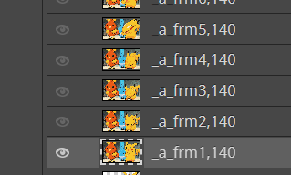  

然后利用魔棒工具

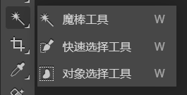  

框选背景图，进行删除：

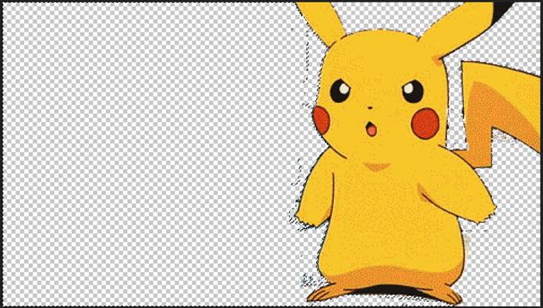  


重复上面操作，最后导出gif图就可以得到纯白背景的动图了。

  

# 2.python环境安装
这次功能上，还额外调用了hugging face模块中的文本生成功能，因此需要安装：
```
pip install huggingface
```

# 3.项目工程

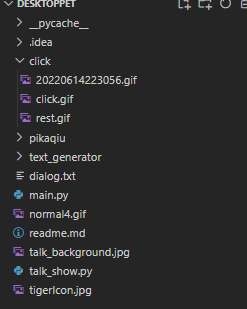  

● main.py：整体功能函数

● dialog.txt：存放随机展示的文本

● pikaqiu：存放随机展示的动图

● talk_show.py：文本生成功能

这里具体介绍怎么使用huggingface导入文本生成模型。

打开huggingface官网：

[https://huggingface.co/](https://huggingface.co/)，然后点击Models，搜索训练好的中文生成模型

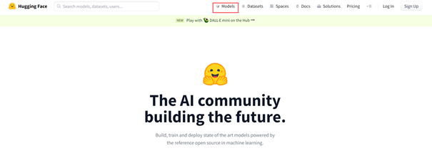  


例如我找到一个GPT中文预训练模型：

  


有两种方法导入，一种是直接利用hugggingface，它会直接下载模型，一种是利用git下载模型：

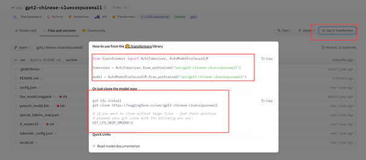  


下载模型后，仅仅需要几行代码，就可以导入模型生成文本：
```python
from transformers import BertTokenizer, GPT2LMHeadModel, TextGenerationPipeline 
tokenizer = BertTokenizer.from_pretrained("uer/gpt2-chinese-cluecorpussmall")
model = GPT2LMHeadModel.from_pretrained("uer/gpt2-chinese-cluecorpussmall")
text_generator = TextGenerationPipeline(model, tokenizer)
```

# 4.功能展示

● 每隔一段时间会变化动图和文字：

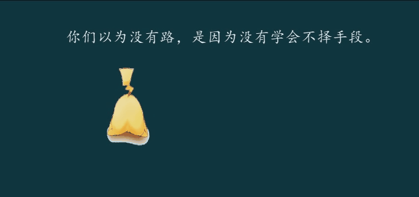  


● 点击宠物时有额外动作

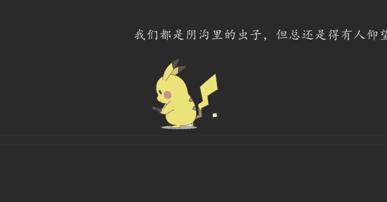  

● “故事大会”功能：跟宠物聊天，进行文本生成

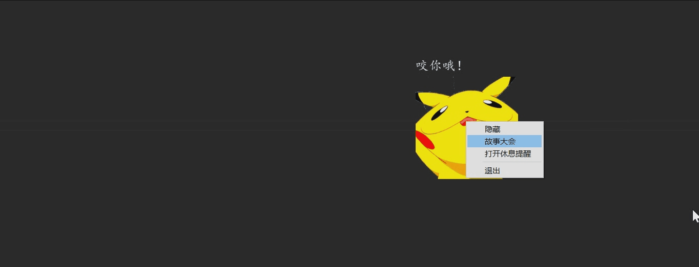  

● “休息一下”功能：隔一个小时提醒你休息功能

  

这是目前项目的所有功能拉，有兴趣的可以下载原代码进行订制属于你的桌面宠物。

这是项目地址：
[https://github.com/llq20133100095/DeskTopPet](https://github.com/llq20133100095/DeskTopPet)

我是leo，我们下期再见~


